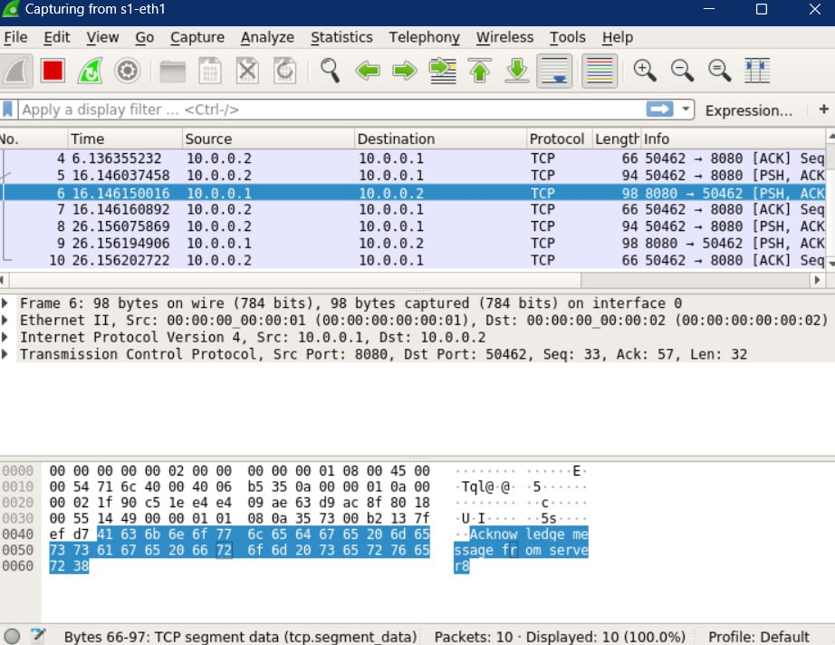

English version [here](README.md)

---

# SDN Service Deployer

> Il progetto SDN Service Deployer è pensato per creare una rete virtuale altamente flessibile e adattabile ai cambiamenti, rendendo il sistema versatile e capace di gestire automaticamente il deployment, l’arresto dei servizi e la creazione del canale per lo scambio di messaggi tra di essi. L’architettura assicura un bilanciamento ottimale degli host, massimizzando l’utilizzo delle risorse di rete. Inoltre, il sistema include una GUI intuitiva per una gestione semplice ed immediata.


## Contenuti
- [Caratteristiche Principali](#caratteristiche-principali)
- [Benefici](#benefici)
- [Casi d'Uso](#casi-duso)
- [Dipendend del Sistema](#dipendenze-del-sistema)
- [Iniziare](#iniziare)
- [Descrizione Workingflow](#descrizione-del-workingflow)
- [Testing](#testing)

---

## Caratteristiche Principali

- **Indipendenza dalla Topologia della rete**:
    - La topologia non è inserita direttamente nel codice
    - Il sistema prende la topologia della rete in input da un file esterno
    - Creazione di un grafico della rete analizzato poi con networkx 


- **Totale Autonomia di Deploy**:
    - Implementa la possibilità di lanciare il servizio senza specificare gli host
    - Il sistema rileverà gli host con meno sevizi e ci farà il deploy in automatico
    - Verrà inoltre creato autonomamente un canale di comunicazione tra i due host
    - Deploy totalmente automatizzato


## Benefici

- **Flessibilità**: Al verificarsi si un cambio della rete non è necessario un intervento nell'architettura del sistema, è sufficiente specificare un diverso file in imput contenente la nuova topologia
- **Autonomia**: Permette all'utente un deploy automatico tramite GUI garantendo allo stesso tempo il mantenimento degli host della rete bilanciati

## Casi d'Uso

- **Reti Aziendali**: Garantisce la continuità aziendale date le modifiche minime da apportare in caso di un cambiamento alla rete
- **Personale con poca esperienza**: Permette di effettuare deploy di servizi da parte di personale senza elevate conoscenze tecniche


## Dipendenze del sistema

Il sistema lavora su macchina virtuale Comnetsemu<br>
Utilizza Mininet per la creazione di una rete virtuale<br> <br>
Sono state sfruttate inoltre le seguenti liberie python

 - NetworkX : libreria Python per lo studio di grafi e reti 
   


## Iniziare

Assicurarsi di stare utilizzando ed avere installate sulla propria macchina tutte le dipendenze necessarie <br> <br>

Comandi di Inizializzazione <br>
Per avviare la rete, il controller e la gui, basta eseguire le seguenti istruzioni: <br>

```bash
ryu-manager FlowController.py
```
*Avvio del controller*

<details>
<summary>output</summary>
    <p align="center">
      
    </p>
</details>

<br>
E su un altro terminale avviare lo script della GUI tramite il comando:
<br>

```bash
sudo python3 GUImain.py
```
*Avvio della GUI*

<p align="center">
    
</p>


## Descrizione del workingflow

#### Deploy di un servizio
1. Inserire il nome del servizio voluto
2. premere il pulsante Deploy - verrànno chiamate a cascata le seguenti funzioni
3. Deploy di un server
    ```python
    def deploy_service(self, net, service_name, port, host_server = None, host_name=None):
        if not self.service_count:
            self.service_count = {host.name: {"count": 0, "services": []} for host in net.hosts}

        try:
            if not host_name:
                host_name = min(self.service_count, key=lambda h: self.service_count[h]["count"])
                print(f"Deploying on:{host_name}")

            host = net.get(host_name)
            remote_path = f"/home/mininet/{service_name}"

            print(f"Starting {service_name} on {host_name}")
            if service_name == "server.py":
                host.cmd(f'python3 {service_name} {port}&')
            else:
                fm = FlowManager()

                fm.create_flow(net, host_name, host_server)
                host.cmd(f"ping -c 1 {net.get(host_server)}")
                time.sleep(5)

                ip = net.get(host_server)
                ip = ip.IP()
                host.cmd(f'python3 {service_name} {port} {ip}&')

            if host_name not in self.service_count:
                self.service_count[host_name] = {"count": 0, "services": []}
            self.service_count[host_name]["count"] += 1
            self.service_count[host_name]["services"].append(port)

            deployment_info = {
                "service_name": service_name,
                "host": host_name,
                "status": "success",
                "remote_path": remote_path
            }
            self.deployments.append(deployment_info)
            print(f"Successfully deployed {service_name} on {host_name}")
            return host_name 

        except Exception as e:
            deployment_info = {
                "service_name": service_name,
                "host": host_name,
                "status": "failed",
                "error": str(e)
            }
            self.deployments.append(deployment_info)
            print(f"Error during deployment of {service_name} on {host_name}: {e}")
    ```

4. Deploy del client con la medesima funzione specificando `service_name`, notare che contiene la funzione `create_flow` (riportata sotto) la quale crea il canale di comunicazione tra i due host
    ```python
        def create_flow(self, net, h1, h2):
        nxTopo = nx.Graph()
        for switch in net.switches:
            nxTopo.add_node(switch)

        for host in net.hosts:
            nxTopo.add_node(host)

        for link in net.links:
            nxTopo.add_edge(link.intf1.node.name, link.intf2.node.name)

        path = nx.shortest_path(nxTopo, h1, h2)

        flow_entries = []

        for step in range(len(path)-1):
            if step == 0:
                port_host_send = net.linksBetween(net.get(path[0]), net.get(path[1]))[0].intf1.name

                if not port_host_send.split('-')[0] == path[1]:
                    port_host_send = net.linksBetween(net.get(path[step]), net.get(path[step+1]))[0].intf2.name

                port_host_send = int(port_host_send.split('eth')[1])
                flow_entry = {
                    "dpid": "%016x" % (int(net.get(path[1]).name.split('s')[1])),
                    "src": f"10.0.0.{path[len(path)-1].split('h')[1]}",
                    "dst": f"10.0.0.{path[0].split('h')[1]}",
                    "actions": [{"type": "OUTPUT", "port": port_host_send}]
                }
                flow_entries.append(flow_entry)

            else:
                if step == len(path)-2:
                    port_host_receiver = net.linksBetween(net.get(path[step]), net.get(path[step+1]))[0].intf1.name

                    if not port_host_receiver.split('-')[0] == path[step]:
                        port_host_receiver = net.linksBetween(net.get(path[step]), net.get(path[step+1]))[0].intf2.name

                    port_host_receiver = int(port_host_receiver.split('eth')[1])
                    flow_entry = {
                        "dpid":  "%016x" % (int(net.get(path[step]).name.split('s')[1])),
                        "src": f"10.0.0.{path[0].split('h')[1]}",
                        "dst": f"10.0.0.{path[len(path)-1].split('h')[1]}",
                        "actions": [{"type": "OUTPUT", "port": port_host_receiver}]
                    }
                    flow_entries.append(flow_entry)
                else:
                    port_send = net.linksBetween(net.get(path[step]), net.get(path[step+1]))[0].intf1.name
                    port_return = net.linksBetween(net.get(path[step]), net.get(path[step+1]))[0].intf2.name
                    
                    if not port_send.split('-')[0] == path[step]:
                        port_send = net.linksBetween(net.get(path[step]), net.get(path[step+1]))[0].intf2.name
                        port_return = net.linksBetween(net.get(path[step]), net.get(path[step+1]))[0].intf1.name

                    port_send = int(port_send.split('eth')[1])
                    flow_entry_send = {
                        "dpid":  "%016x" % (int(net.get(path[step]).name.split('s')[1])),
                        "dst": f"10.0.0.{path[len(path)-1].split('h')[1]}",
                        "src": f"10.0.0.{path[0].split('h')[1]}",
                        "actions": [{"type": "OUTPUT", "port": port_send}]
                    }
                    flow_entries.append(flow_entry_send)

                    port_return = int(port_return.split('eth')[1])
                    flow_entry_return = {
                        "dpid": "%016x" % (int(net.get(path[step+1]).name.split('s')[1])),
                        "dst": f"10.0.0.{path[0].split('h')[1]}",
                        "src": f"10.0.0.{path[len(path)-1].split('h')[1]}",
                        "actions": [{"type": "OUTPUT", "port": port_return}]
                    }
                    flow_entries.append(flow_entry_return)
    ```


#### Arresto di un servizio
1. selezionare dal menu a tendina il servizio che si vuole arrestare
2. premere il pulsante Delete - verranno chiamate a cascata le seguanti funzioni
4. Stop client
  ```python
    def stop_service(self, net, service_name, port, host_name=None):
        try:
            if host_name:
                self._stop_service_on_host(net, port, host_name)
            else:
                print(f"Stopping all services on port: {port}")
                for host in self.service_count:
                    self._stop_service_on_host(net, port, host, service_name)
        except Exception as e:
            print(f"Error during stopping service on port: {port}: {e}")

    def _stop_service_on_host(self, net, port, host_name, service_name):
        host = net.get(host_name)
        print(f"Stopped service on port:{port} on {host_name}")
        host.cmd(f'fuser -k {port}/tcp')    
        print(host.cmd(f'ps'))

        if host_name in self.service_count and self.service_count[host_name]["count"] > 0:
            if port in self.service_count[host_name]["services"]:
                self.service_count[host_name]["services"].remove(port)
                self.service_count[host_name]["count"] -= 1
                print(f"Service at port: {port} stopped successfully on {host_name}")
  ```

5. Stop server, anche in questo caso sono state usate le stesse funzioni, specificando `service_name`
6. Rimozione del canale di comunicazione
     ```python
       def delete_flow(self, het, h1, h2):

        flow_write = []

        with open('flow.json', 'r') as json_file:
            flow_entries = json.load(json_file)

        for flow in flow_entries:
            if (flow["src"]==f"10.0.0.{h1.split('h')[1]}" or flow["src"]==f"10.0.0.{h2.split('h')[1]}") and (flow["dst"]==f"10.0.0.{h1.split('h')[1]}" or flow["dst"]==f"10.0.0.{h2.split('h')[1]}"):
                print(f"removed {h1}->{h2}")
            else:
                flow_write.append(flow)

        with open('flow.json', 'w') as json_file:
            json.dump(flow_write, json_file, indent=4)
      ```

<br>
Tutte le operazioni verranno mostrate all'utente tramite un comodo schermo presente nell'interfaccia grafica

<details>
<summary>output</summary>
    <p align="center">
      
    </p>
</details>


## Testing

è possibile controllare tramite Wireshark l'effettivo scambio di messaggi tra client e server

<details>
    <p align="center">
      
    </p>
</details>

<br>
esempio di corretto funzionamento

<details>

---

   <br> *messaggio di avvenuto Deploy del servizio* <br>
  <br> *messaggio di avvenuto Arresto del servizio*

</details>


