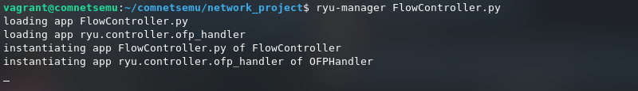
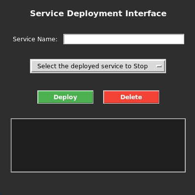
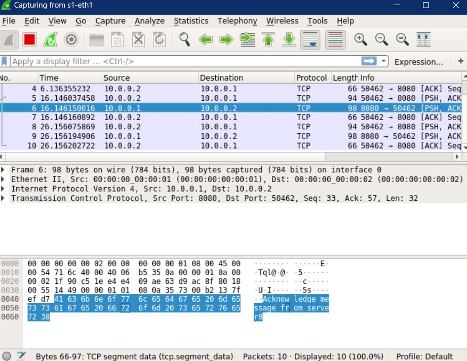
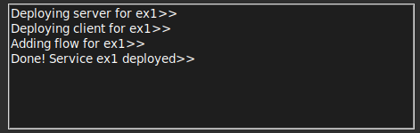

Italian version [here](README-it.md)

---


# SDN Service Deployer

> The SDN Service Deployer project is designed to create a highly flexible and adaptable virtual network, 
making the system versatile and capable of automatically managing the deployment, termination of services, 
and the establishment of a messaging channel between them. The architecture ensures optimal host load balancing, 
maximizing the use of network resources. Additionally, the system includes an intuitive GUI for simple and immediate management.

## Contents
- [Main Features](#main-features)
- [Benefits](#benefits)
- [Use Cases](#use-cases)
- [Dependencies](#dependencies)
- [Getting Started](#getting-started)
- [Workflow Description](#workflow-description)
- [Testing](#testing)

---

## Main Features

- **Network Topology Independence**:
    - The topology is not embedded in the code.
    - The system takes the network topology as input from an external file.
    - A network graph is created and analyzed using networkx.

- **Total Deployment Autonomy**:
    - Enables launching the service without specifying hosts.
    - The system detects hosts with the fewest services and automatically deploys on them.
    - A communication channel between two hosts is automatically created.
    - Fully automated deployment.

## Benefits

- **Flexibility**: If there is a change in the network, no changes to the system architecture are required—simply specify a new input file with the updated topology.
- **Autonomy**: Allows users to deploy automatically via the GUI while maintaining balanced network hosts.

## Use Cases

- **Corporate Networks**: Ensures business continuity with minimal changes in case of network modifications.
- **Non-Technical Staff**: Enables service deployment by staff with limited technical knowledge.

## Dependencies

The system runs on a Comnetsemu virtual machine.  
Uses Mininet to create a virtual network.  

Additionally, the following Python libraries are used:

 - NetworkX: a Python library for studying graphs and networks.

## Getting Started

Ensure that you are using and have installed all necessary dependencies on your machine.  

Initialization Commands  
To start the network, controller, and GUI, execute the following commands:  

```bash
ryu-manager FlowController.py
```
*Start the controller*

<details>
<summary>output</summary>
    <p align="center">
      
    </p>
</details>

In a different terminal, start the GUI script with the command:

```bash
sudo python3 GUImain.py
```
*Start the GUI*

<p align="center">
    
</p>

## Workflow Description

#### Deploying a Service
1. Enter the desired service name.
2. Click the Deploy button – the following functions will be called sequentially.
3. Deploy a server
    ```python
    def deploy_service(self, net, service_name, port, host_server = None, host_name=None):
        # Code snippet continues as in the original file
    ```

4. Deploy the client using the same function by specifying `service_name`. Note that it includes the `create_flow` function (shown below), which establishes a communication channel between the two hosts.
    ```python
    def create_flow(self, net, h1, h2):
    # Code snippet continues as in the original file
    ```

#### Stopping a Service
1. Select the service to stop from the drop-down menu.
2. Click the Delete button – the following functions will be called sequentially.
4. Stop client
  ```python
    def stop_service(self, net, service_name, port, host_name=None):
        # Code snippet continues as in the original file
  ```

5. Stop server using the same functions, specifying `service_name`.
6. Remove the communication channel.
     ```python
       def delete_flow(self, het, h1, h2):
       # Code snippet continues as in the original file
      ```

All operations will be displayed to the user through a convenient screen in the graphical interface.

<details>
<summary>output</summary>
    <p align="center">
      
    </p>
</details>

## Testing

You can use Wireshark to monitor the actual message exchange between client and server.

<details>
    <p align="center">
      
    </p>
</details>

Example of correct operation

<details>

---


*Message confirming service deployment*  


*Message confirming service termination*

</details>


[Video demo](https://www.youtube.com/watch?v=0IURpXwvLrw)

