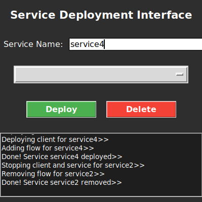

Italian version [here](README-it.md)

---


# SDN Service Deployer

> The SDN Service Deployer project is designed to create a highly flexible and adaptable virtual network, 
making the system versatile and capable of automatically managing the deployment, termination of services, 
and the establishment of a messaging channel between them. The architecture ensures optimal host load balancing, 
maximizing the use of network resources. Additionally, the system includes an intuitive GUI for simple and immediate management.

## Contents
- [Main Features](#main-features)
- [Benefits](#benefits)
- [Use Cases](#use-cases)
- [Dependencies](#dependencies)
- [Getting Started](#getting-started)
- [Workflow Description](#workflow-description)
- [Testing](#testing)

---

## Main Features

- **Network Topology Independence**:
    - The topology is not embedded in the code.
    - The system takes the network topology as input from an external file.
    - A network graph is created and analyzed using networkx.

- **Total Deployment Autonomy**:
    - Enables launching the service without specifying hosts.
    - The system detects hosts with the fewest services and automatically deploys on them.
    - A communication channel between two hosts is automatically created.
    - Fully automated deployment.

## Benefits

- **Flexibility**: If there is a change in the network, no changes to the system architecture are required—simply specify a new input file with the updated topology.
- **Autonomy**: Allows users to deploy automatically via the GUI while maintaining balanced network hosts.

## Use Cases

- **Corporate Networks**: Ensures business continuity with minimal changes in case of network modifications.
- **Non-Technical Staff**: Enables service deployment by staff with limited technical knowledge.

## Dependencies

The system runs on a Comnetsemu virtual machine.  
Uses Mininet to create a virtual network.  

Additionally, the following Python libraries are used:

 - NetworkX: a Python library for studying graphs and networks.

## Getting Started

Ensure that you are using and have installed all necessary dependencies on your machine.  

Initialization Commands  
To start the network, controller, and GUI, execute the following commands:  

```bash
ryu-manager FlowController.py
```
*Start the controller*

<details>
<summary>output</summary>
    <p align="center">
      
    </p>
</details>

In a different terminal, start the GUI script with the command:

```bash
sudo python3 GUImain.py
```
*Start the GUI*

<p align="center">
    
</p>

## Workflow Description

#### Deploying a Service
1. Enter the desired service name.
2. Click the Deploy button – the following functions will be called sequentially.
3. Deploy a server
    ```python
    def deploy_service(self, net, service_name, port, host_server = None, host_name=None):
        if not self.service_count:
            self.service_count = {host.name: {"count": 0, "services": []} for host in net.hosts}
    
        try:
            if not host_name:
                host_name = min(self.service_count, key=lambda h: self.service_count[h]["count"])
                print(f"Deploying on:{host_name}")
    
            host = net.get(host_name)
            remote_path = f"/home/mininet/{service_name}"
    
            print(f"Starting {service_name} on {host_name}")
            if service_name == "server.py":
                host.cmd(f'python3 {service_name} {port}&')
            else:
                fm = FlowManager()
    
                fm.create_flow(net, host_name, host_server)
                host.cmd(f"ping -c 1 {net.get(host_server)}")
                time.sleep(5)
    
                ip = net.get(host_server)
                ip = ip.IP()
                host.cmd(f'python3 {service_name} {port} {ip}&')
    
            if host_name not in self.service_count:
                self.service_count[host_name] = {"count": 0, "services": []}
            self.service_count[host_name]["count"] += 1
            self.service_count[host_name]["services"].append(port)
    
            deployment_info = {
                "service_name": service_name,
                "host": host_name,
                "status": "success",
                "remote_path": remote_path
            }
            self.deployments.append(deployment_info)
            print(f"Successfully deployed {service_name} on {host_name}")
            return host_name 
    
        except Exception as e:
            deployment_info = {
                "service_name": service_name,
                "host": host_name,
                "status": "failed",
                "error": str(e)
            }
            self.deployments.append(deployment_info)
            print(f"Error during deployment of {service_name} on {host_name}: {e}")
    ```

4. Deploy the client using the same function by specifying `service_name`. Note that it includes the `create_flow` function (shown below), which establishes a communication channel between the two hosts.
    ```python
    def create_flow(self, net, h1, h2):
        nxTopo = nx.Graph()
        for switch in net.switches:
            nxTopo.add_node(switch)
    
        for host in net.hosts:
            nxTopo.add_node(host)
    
        for link in net.links:
            nxTopo.add_edge(link.intf1.node.name, link.intf2.node.name)
    
        path = nx.shortest_path(nxTopo, h1, h2)
    
        flow_entries = []
    
        for step in range(len(path)-1):
            if step == 0:
                port_host_send = net.linksBetween(net.get(path[0]), net.get(path[1]))[0].intf1.name
    
                if not port_host_send.split('-')[0] == path[1]:
                    port_host_send = net.linksBetween(net.get(path[step]), net.get(path[step+1]))[0].intf2.name
    
                port_host_send = int(port_host_send.split('eth')[1])
                flow_entry = {
                    "dpid": "%016x" % (int(net.get(path[1]).name.split('s')[1])),
                    "src": f"10.0.0.{path[len(path)-1].split('h')[1]}",
                    "dst": f"10.0.0.{path[0].split('h')[1]}",
                    "actions": [{"type": "OUTPUT", "port": port_host_send}]
                }
                flow_entries.append(flow_entry)
    
            else:
                if step == len(path)-2:
                    port_host_receiver = net.linksBetween(net.get(path[step]), net.get(path[step+1]))[0].intf1.name
    
                    if not port_host_receiver.split('-')[0] == path[step]:
                        port_host_receiver = net.linksBetween(net.get(path[step]), net.get(path[step+1]))[0].intf2.name
    
                    port_host_receiver = int(port_host_receiver.split('eth')[1])
                    flow_entry = {
                        "dpid":  "%016x" % (int(net.get(path[step]).name.split('s')[1])),
                        "src": f"10.0.0.{path[0].split('h')[1]}",
                        "dst": f"10.0.0.{path[len(path)-1].split('h')[1]}",
                        "actions": [{"type": "OUTPUT", "port": port_host_receiver}]
                    }
                    flow_entries.append(flow_entry)
                else:
                    port_send = net.linksBetween(net.get(path[step]), net.get(path[step+1]))[0].intf1.name
                    port_return = net.linksBetween(net.get(path[step]), net.get(path[step+1]))[0].intf2.name
                    
                    if not port_send.split('-')[0] == path[step]:
                        port_send = net.linksBetween(net.get(path[step]), net.get(path[step+1]))[0].intf2.name
                        port_return = net.linksBetween(net.get(path[step]), net.get(path[step+1]))[0].intf1.name
    
                    port_send = int(port_send.split('eth')[1])
                    flow_entry_send = {
                        "dpid":  "%016x" % (int(net.get(path[step]).name.split('s')[1])),
                        "dst": f"10.0.0.{path[len(path)-1].split('h')[1]}",
                        "src": f"10.0.0.{path[0].split('h')[1]}",
                        "actions": [{"type": "OUTPUT", "port": port_send}]
                    }
                    flow_entries.append(flow_entry_send)
    
                    port_return = int(port_return.split('eth')[1])
                    flow_entry_return = {
                        "dpid": "%016x" % (int(net.get(path[step+1]).name.split('s')[1])),
                        "dst": f"10.0.0.{path[0].split('h')[1]}",
                        "src": f"10.0.0.{path[len(path)-1].split('h')[1]}",
                        "actions": [{"type": "OUTPUT", "port": port_return}]
                    }
                    flow_entries.append(flow_entry_return)
    ```

#### Stopping a Service
1. Select the service to stop from the drop-down menu.
2. Click the Delete button – the following functions will be called sequentially.
3. Stop client
  ```python
  def stop_service(self, net, service_name, port, host_name=None):
      try:
          if host_name:
              self._stop_service_on_host(net, port, host_name)
          else:
              print(f"Stopping all services on port: {port}")
              for host in self.service_count:
                  self._stop_service_on_host(net, port, host, service_name)
      except Exception as e:
          print(f"Error during stopping service on port: {port}: {e}")

  def _stop_service_on_host(self, net, port, host_name, service_name):
      host = net.get(host_name)
      print(f"Stopped service on port:{port} on {host_name}")
      host.cmd(f'fuser -k {port}/tcp')    
      print(host.cmd(f'ps'))

      if host_name in self.service_count and self.service_count[host_name]["count"] > 0:
          if port in self.service_count[host_name]["services"]:
              self.service_count[host_name]["services"].remove(port)
              self.service_count[host_name]["count"] -= 1
              print(f"Service at port: {port} stopped successfully on {host_name}")
  ```

4. Stop server using the same functions, specifying `service_name`.
5. Remove the communication channel.
     ```python
    def delete_flow(self, het, h1, h2):

       flow_write = []
    
       with open('flow.json', 'r') as json_file:
           flow_entries = json.load(json_file)
    
       for flow in flow_entries:
           if (flow["src"]==f"10.0.0.{h1.split('h')[1]}" or flow["src"]==f"10.0.0.{h2.split('h')[1]}") and (flow["dst"]==f"10.0.0.{h1.split('h')[1]}" or flow["dst"]==f"10.0.0.{h2.split('h')[1]}"):
               print(f"removed {h1}->{h2}")
           else:
               flow_write.append(flow)
    
       with open('flow.json', 'w') as json_file:
           json.dump(flow_write, json_file, indent=4)
      ```

All operations will be displayed to the user through a convenient screen in the graphical interface.

<details>
<summary>Example</summary>
    <p align="center">
      
    </p>
</details>

## Testing

You can use Wireshark to monitor the actual message exchange between client and server.

<details>
    <p align="center">
      
    </p>
</details>

Example of correct operation

<details>

---


*Message confirming service deployment*  


*Message confirming service termination*

</details>


